# Qanlex Web Scraper

## Descripción del Proyecto
Este proyecto implementa un scraper web diseñado para recopilar información judicial del sitio [Poder Judicial de la Nación](http://scw.pjn.gov.ar/scw/home.seam). El objetivo es extraer datos clave como:

- Expediente
- Dependencia
- Demandante
- Demandado
- Carátula
- Tipo de demanda
- Juzgado o tribunal
- Fechas relevantes

Los resultados se almacenan en una base de datos MySQL y se exportan en un excel para su análisis posterior.

## Características
- **Automatización del CAPTCHA** utilizando el servicio [2Captcha](https://2captcha.com).
- **Despliegue automatizado en AWS**, con:
  - Una instancia EC2 configurada para ejecutar el scraper diariamente a las 8:00 AM.
  - Control de encendido/apagado de la instancia mediante AWS Lambda y EventBridge.
- **Almacenamiento en MySQL** de los datos extraídos.
- **Integración continua** mediante un script automatizado que actualiza el código desde GitHub y ejecuta el scraper al iniciarse la instancia.

---

## Guía de Instalación y Ejecución Local

### Requisitos Previos
1. Python 3.11 o compatible.
2. Google Chrome y ChromeDriver (instalado localmente).
3. MySQL Server configurado.
4. Una cuenta en [2Captcha](https://2captcha.com) (opcional).

### Instrucciones
1. **Clonar el Repositorio**
   ```bash
   git clone https://github.com/tuusuario/qanlex-scraper.git
   cd qanlex-scraper
   ```

2. **Crear un Entorno Virtual**
   ```bash
   python3 -m venv env
   source env/bin/activate #Linux
   .\env\Scripts\activate #Windows
   ```

3. **Instalar Dependencias**
   ```bash
   pip install -r requirements.txt
   ```

4. **Configurar Variables de Entorno**
   Crear un archivo `.env` en el directorio del proyecto con el siguiente contenido:
   ```env
   DB_HOST=localhost
   DB_USER=user
   DB_PASSWORD=password
   DB_DATABASE=expedientes

   PRODUCTION=false
   APIKEY_2CAPTCHA=
   ```

   - Dejar `APIKEY_2CAPTCHA` vacío si planeas resolver los CAPTCHAs manualmente.

5. **Ejecutar el Script**
   ```bash
   python scrape.py
   ```
   Si `APIKEY_2CAPTCHA` está vacío, deberás resolver los CAPTCHAs manualmente y presionar **Enter** cuando termines.

---

## Despliegue en AWS

### Configuración de la Instancia EC2 Ubuntu
1. **Instalar Dependencias**
   - Google Chrome y ChromeDriver.
   - Python 3.11 y librerías necesarias.

2. **Configurar el Script de Inicio**

   Archivo `ci_script.sh`:
   ```bash
   #!/bin/bash
   cd /home/ubuntu/Qanlex-Scrapper/
   git pull origin master
   python3 scrape.py
   sudo shutdown -h now
   ```

   Este script facilita la integración continua al realizar un `git pull` para actualizar el código antes de ejecutar el proceso de scraping. Una vez finalizado, apaga la instancia automáticamente, optimizando el uso de recursos.

   Archivo de servicio `/etc/systemd/system/miscript.service`:
   ```ini
   [Unit]
   Description=Mi Script de Inicio
   After=network.target

   [Service]
   ExecStart=/bin/bash /home/ubuntu/ci_script.sh
   Restart=always
   User=ubuntu

   [Install]
   WantedBy=multi-user.target
   ```

3. **Habilitar el Servicio**
   ```bash
   sudo systemctl daemon-reload
   sudo systemctl enable miscript.service
   ```

### Programación Automática
1. **Lambda Function** para encender la instancia:
   - Código para iniciar la instancia EC2.

    ```python
    import boto3
    ec2 = boto3.client('ec2')
    def lambda_handler(event, context):
        instance_id = 'i-008f71f690618715d'  
        ec2.start_instances(InstanceIds=[instance_id])
        return {
            'statusCode': 200,
            'body': f'Instancia {instance_id} encendida correctamente'
        }
    ```

   - Configurada como target de un evento diario en EventBridge (8:00 AM).

2. **Programación de EventBridge**:
   - Configurar una regla de EventBridge para ejecutar la función Lambda todos los días a las 8:00 AM utilizando un cron expression: `0 8 * * ? *`.

---

### Almacenamiento de Datos
1. **Base de Datos MySQL**:
   - Crear una instancia en AWS RDS.
   - Configurar las credenciales en el archivo `.env` del scraper.

---

## Opcionales Realizados
1. **Automatización del CAPTCHA**: Implementado con 2Captcha.
2. **Despliegue en AWS**:
   - Instancia EC2 configurada para ejecutar el scraper.
   - Automatización del encendido y apagado con Lambda y EventBridge.
3. **Almacenamiento en MySQL**: Los datos del scraper se almacenan en una tabla MySQL.
4. **Integración Continua**: Actualización del código desde GitHub al iniciar la instancia.

---

## Capturas de Pantalla
A continuación se muestran ejemplos de la implementación de los opcionales:
1. **Automatización del CAPTCHA**:
   
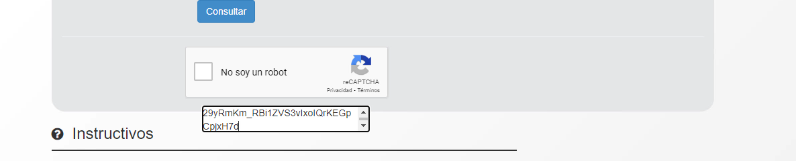

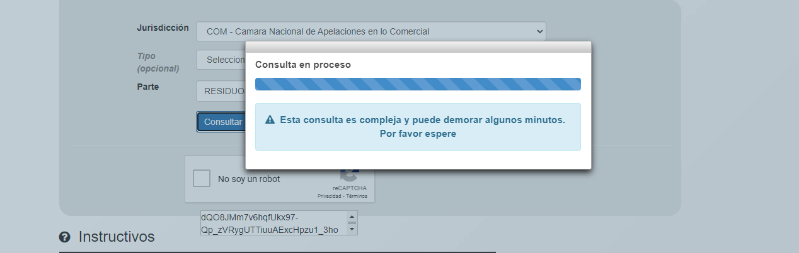

2. **Instancia EC2**:

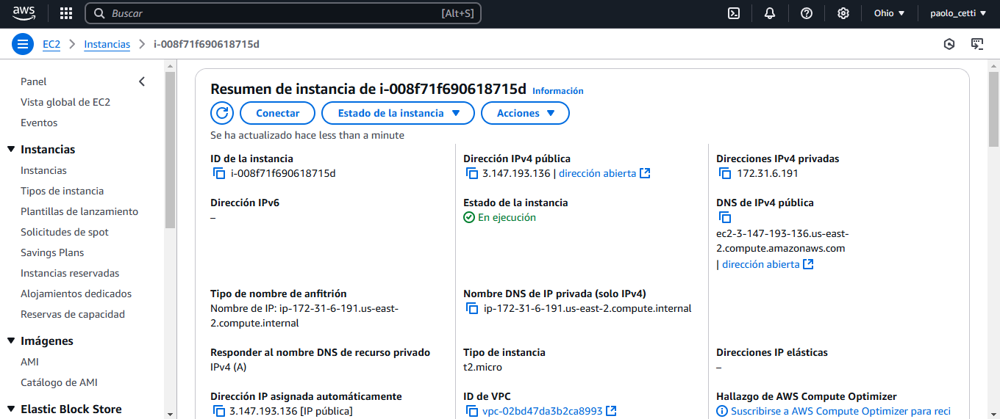

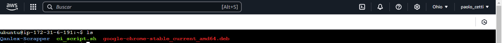

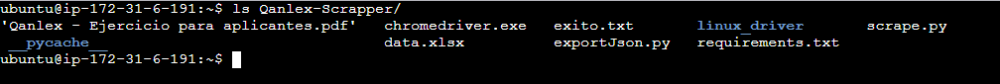

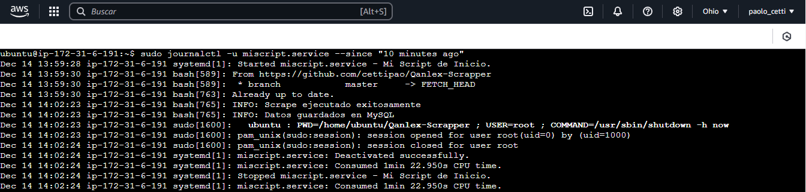

3. **Funcion Lambda**:
   
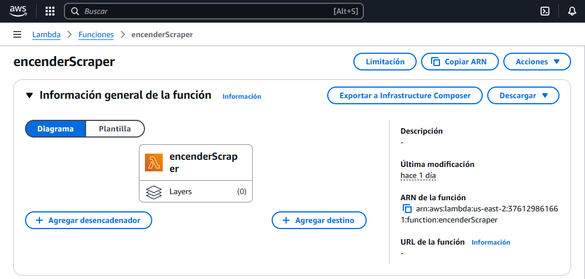

4. **Programacion EventBridge**:

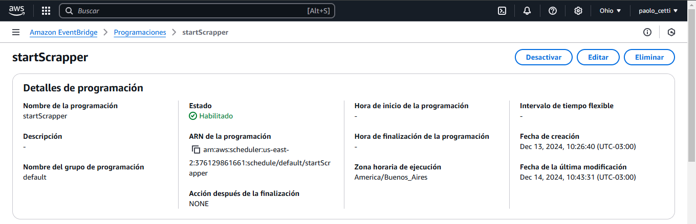

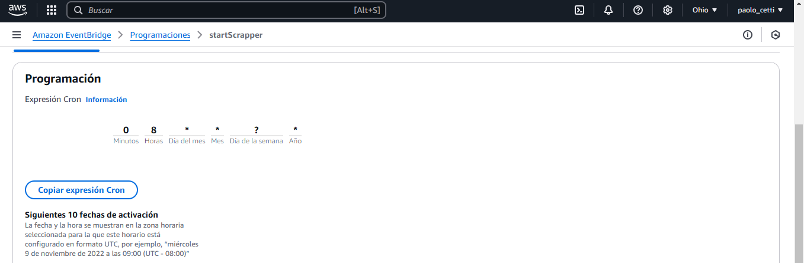

5. **Base de Datos**:

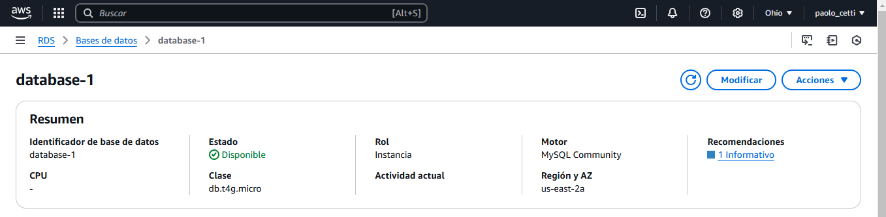
   
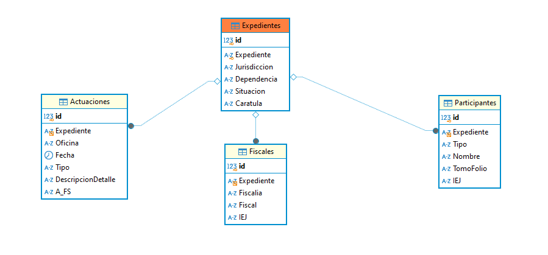

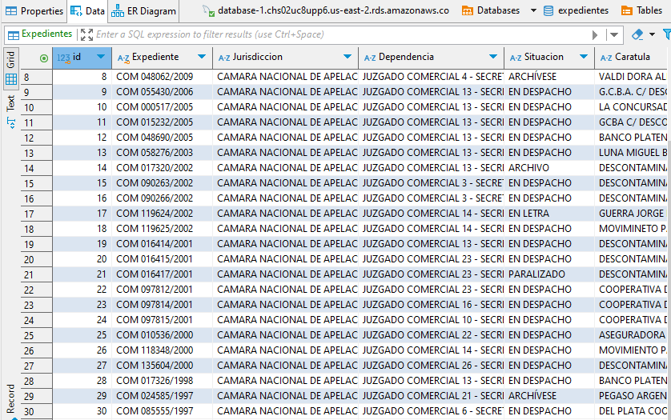

---

## Posibles Mejoras
1. **Pipeline de GitHub Actions**: Implementar un pipeline que ejecute pruebas automáticas del scraper y verifique su funcionamiento antes de pasar a producción. Esto incluye pruebas de unidad, integración y despliegue automatizado.

2. **Manejo de Errores y Retries**: Mejorar la robustez del scraper añadiendo lógica de reintentos en caso de fallos y utilizando colas de mensajes para manejar tareas en segundo plano de forma eficiente.

3. **Optimización de la Extracción de Datos**: Implementar scraping en paralelo con herramientas como Scrapy o Celery para reducir el tiempo de extracción en grandes volúmenes de datos.

4. **Monitoreo y Notificaciones**: Añadir notificaciones y un sistema de monitoreo (como Slack o ELK Stack) para alertar sobre fallos en tiempo real.

## Desarrollador
Este proyecto fue desarrollado por **Paolo Cetti** como parte de un ejercicio de selección para Qanlex.

